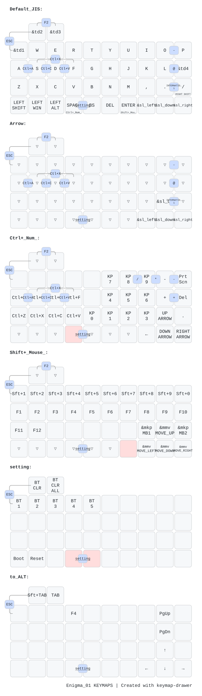

# キーマップ編集ガイド  

ここではキーマップ編集の手順を説明します。  
総合案内は[こちら](https://github.com/nazuna293/Enigma_01)です。

## キーマップ編集  

2つの方法を案内します。  
複雑な編集はKeymapEditorが適していますが、初めての編集はZMK Studioがおすすめです。  

|項目|KeymapEditor [編集手順](docs/KeymapEditor.md)|ZMK Studio [編集手順](docs/ZMK_Studio.md)|  
|:-:|:-|:-|  
|事前準備|GitHubのアカウント登録 リポジトリのフォーク、登録|特になし|  
|編集方法|ブラウザ上でマウス操作→ファームウェアの書き出し、転送|ブラウザ上でマウス操作→ブラウザ上で上書き保存|  
|編集項目| マクロ等も編集できる|標準的な編集ができる|  

## 初期キーマップ
このリポジトリのキーマップの状態は[こちら](docs/keymap.md)で確認できます。

### Tap Dance
||1回押し|長押し|2回押し|
|:-:|:-:|:-:|:-:|
|tp1|Tab|Ctrl|Q|
|tp2|半／全|ALT layer||
|tp3|F7|ALT layer|F8|
|tp4|:||;|

### Macro
||内容|
|:-:|:-:|
|up|上矢印 + &sl Arrow|
|down|下矢印 + &sl Arrow|
|left|左矢印 + &sl Arrow|
|right|右矢印 + &sl Arrow|

※レイヤー4に推移している間はALTキーが押されている状態になっています。

